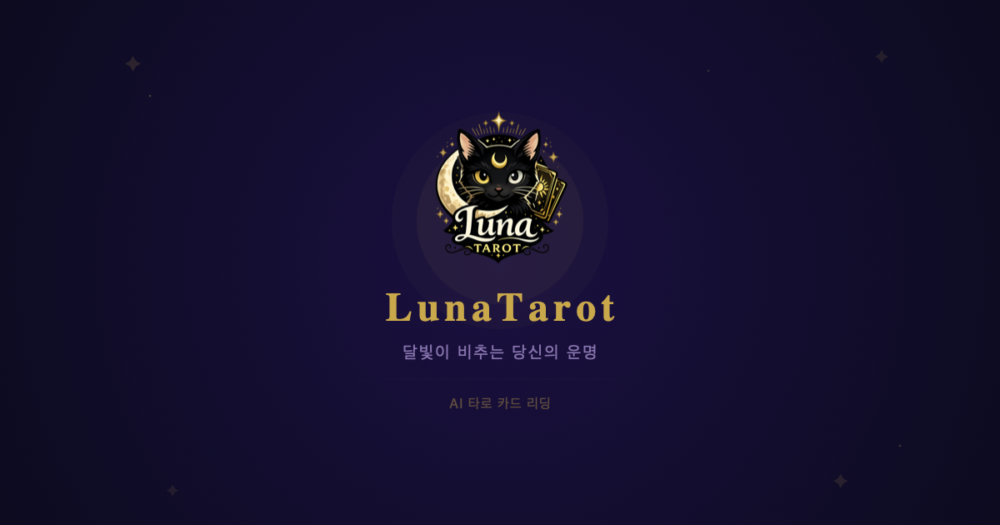

# Luna

타로 · 점성술 · 사주 운세 웹 애플리케이션

> https://tarot-destiny-app.vercel.app

> 달빛이 비추는 당신의 운명

<p align="center">
  
</p>

<p align="center">
  
</p>

## 소개

Luna는 타로 카드, 별자리 점성술, 사주팔자로 운명을 읽어주는 운세 리딩 서비스입니다. 루나가 따뜻하고 자연스러운 해석을 들려드려요.

### 타로 카드

- 🎴 **12가지 운세 카테고리** — 연애운, 커플운, 우정운, 시험운, 적성운, 학업운, 이직운, 건강운, 전생운, 회사운, 재회운, 재혼운
- 🃏 **78장 타로 덱** — 메이저 아르카나 22장 + 마이너 아르카나 56장
- 🎯 **부채꼴 카드 뽑기** — 78장 중 20장을 셔플, 6장 선택
- ✦ **카드 뒤집기 애니메이션** — 순차적 공개
- ✦ **Gemini 타로 해석** — 카드 조합 기반 맞춤형 리딩
- ✦ **Gemini 실패 시 DB fallback** — 1,200개 사전 생성 해석 제공

### 점성술

- ✦ **출생 차트 기반 해석** — 생년월일 + 시간 + 장소로 정확한 차트 계산
- ✦ **10개 카테고리** — 오늘/이번 주/이번 달/올해 운세, 궁합, 성격 분석, 연애운, 결혼운, 직업 적성, 나의 별자리
- ✦ **출생 차트 시각화** — 행성 위치 + 하우스 + 어스펙트 SVG 차트
- ✦ **도시 검색** — Nominatim API로 위도/경도 자동 변환
- ✦ **카테고리별 기간 제한** — 일/주/월/년/영구
- ✦ **Gemini → Groq 폴백** — Gemini 실패 시 Groq (Llama) 자동 전환

### 사주 (준비 중)

- ✦ 사주팔자 기반 운세 (개발 예정)

### 공통 기능

- ✦ **카카오/구글 로그인** — NextAuth 기반 소셜 로그인
- ✦ **결과 저장** — Supabase DB에 결과 저장
- ✦ **히스토리** — 타로/점성술 기록 분리 조회
- ✦ **결과 공유** — 모바일 Web Share API, PC 클립보드 복사
- ✦ **관리자 페이지** — 사용자/리딩/통계/fallback 로그 관리
- ✦ **모바일 최적화** — 반응형 UI, safe-area 대응
- ✦ **OG 태그** — SNS 미리보기 지원
- ✦ **매일 다른 인삿말** — 100가지 다정한 메시지

## 기술 스택

| 구분 | 기술 |
|------|------|
| **프론트엔드** | Next.js, React, TypeScript |
| **스타일링** | Tailwind CSS |
| **AI** | Google Gemini API, Groq (Llama) |
| **점성술 계산** | circular-natal-horoscope-js |
| **인증** | NextAuth (카카오/구글 OAuth) |
| **DB** | Supabase |
| **패키지 매니저** | Yarn |
| **배포** | Vercel |

## 프로젝트 구조

```
tarot-destiny-app/
├── frontend/
│   ├── public/
│   │   ├── cards/                 # 파스텔 동물 카드 SVG (22장)
│   │   │   └── rider-waite/       # Rider-Waite 클래식 카드 (78장)
│   │   └── icons/                 # 골드 라인 SVG 아이콘
│   │       └── zodiac/            # 12별자리 아이콘
│   ├── src/
│   │   ├── app/
│   │   │   ├── api/
│   │   │   │   ├── tarot/         # 타로 해석 API
│   │   │   │   ├── astrology/     # 점성술 API (출생정보/해석)
│   │   │   │   ├── admin/         # 관리자 API
│   │   │   │   ├── history/       # 히스토리 API
│   │   │   │   └── auth/          # NextAuth 인증
│   │   │   ├── ctrl-luna/         # 관리자 페이지
│   │   │   ├── login/             # 로그인 페이지
│   │   │   └── result/[id]/       # 결과 공유 페이지
│   │   ├── components/            # UI 컴포넌트
│   │   ├── data/                  # 타로/점성술/인삿말 데이터
│   │   └── lib/                   # 유틸리티 (Supabase, AI, 관리자)
│   └── package.json
└── shared/types/                  # 공유 타입
```

## 시작하기

### 1. 의존성 설치

```bash
cd frontend
yarn install
```

### 2. 환경 변수 설정

```bash
cp .env.example .env
```

`.env` 파일에 필요한 키를 입력합니다:

```
GEMINI_API_KEY=your_gemini_api_key
GROQ_API_KEY=your_groq_api_key
NEXT_PUBLIC_SUPABASE_URL=your_supabase_url
NEXT_PUBLIC_SUPABASE_ANON_KEY=your_supabase_anon_key
NEXTAUTH_SECRET=your_nextauth_secret
NEXTAUTH_URL=http://localhost:3000
KAKAO_CLIENT_ID=your_kakao_client_id
KAKAO_CLIENT_SECRET=your_kakao_client_secret
GOOGLE_CLIENT_ID=your_google_client_id
GOOGLE_CLIENT_SECRET=your_google_client_secret
```

### 3. 개발 서버 실행

```bash
yarn dev
```

[http://localhost:3000](http://localhost:3000)에서 확인할 수 있습니다.

## 카드 디자인

78장의 타로 카드를 두 가지 디자인으로 사용합니다.

### Rider-Waite 클래식 (78장)
연애운, 커플운, 시험운, 학업운, 이직운, 건강운, 전생운, 회사운, 재회운, 재혼운에서 사용됩니다.
퍼블릭 도메인인 Rider-Waite 타로 카드 이미지를 활용했습니다.
- 메이저 아르카나 22장 (The Fool ~ The World)
- 마이너 아르카나 56장 (완드/컵/소드/펜타클 × 14장)

### 파스텔 동물 카드 (22장)
우정운, 적성운에서 사용됩니다.
메이저 아르카나 22장을 파스텔 스타일의 귀여운 동물 캐릭터로 디자인했습니다.
