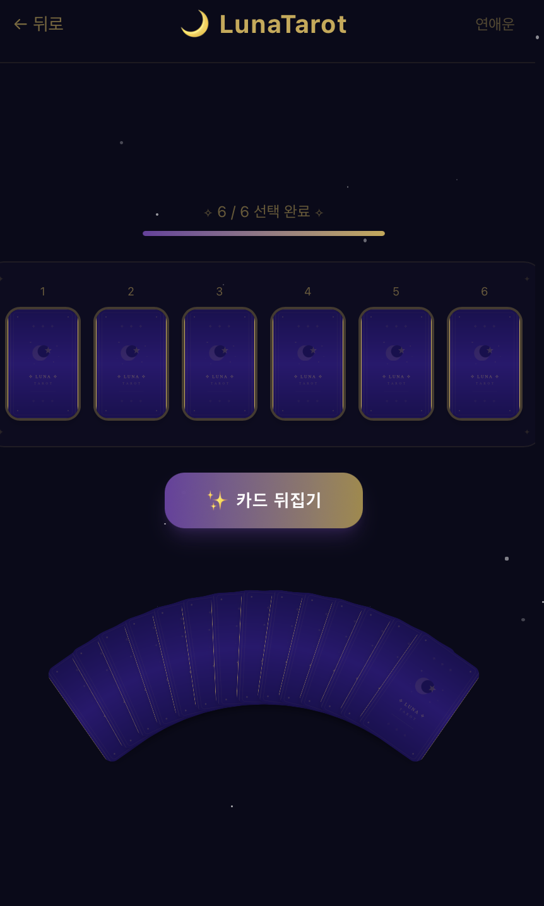

# 🌙 LunaTarot

AI 기반 타로 카드 리딩 웹 애플리케이션

> 달빛이 비추는 당신의 운명

<p align="center">
  
</p>

## 소개

LunaTarot은 귀여운 파스텔 타로 카드를 뽑고, AI가 카드를 해석해주는 타로 리딩 서비스입니다.

### 주요 기능

- 🎴 **8가지 운세 카테고리** — 연애운, 커플운, 우정운, 시험운, 적성운, 학업운, 이직운, 건강운
- 🃏 **부채꼴 카드 뽑기** — 20장 중 6장을 선택하는 인터랙티브 UI
- ✨ **카드 뒤집기 애니메이션** — 6장을 뽑은 후 한 장씩 순차적으로 공개
- 🔮 **AI 타로 해석** — AI를 활용한 맞춤형 타로 리딩 (준비 중)
- 📱 **모바일 앱뷰** — 모바일 최적화 UI

## 기술 스택

| 구분 | 기술 |
|------|------|
| **프론트엔드** | Next.js, React, TypeScript |
| **스타일링** | Tailwind CSS |
| **AI** | 준비 중 |
| **패키지 매니저** | Yarn |

## 프로젝트 구조

```
tarot-destiny-app/
├── frontend/
│   ├── public/cards/         # 타로 카드 SVG 이미지 (22장 + 뒷면)
│   ├── src/
│   │   ├── app/
│   │   │   ├── api/tarot/    # 타로 해석 API (준비 중)
│   │   │   ├── page.tsx      # 메인 페이지
│   │   │   ├── layout.tsx    # 레이아웃
│   │   │   └── globals.css   # 글로벌 스타일
│   │   ├── components/       # UI 컴포넌트
│   │   ├── data/             # 타로 카드 데이터
│   │   └── lib/              # 유틸리티
│   └── package.json
└── shared/types/             # 공유 타입
```

## 시작하기

### 1. 의존성 설치

```bash
cd frontend
yarn install
```

### 2. 개발 서버 실행

```bash
yarn dev
```

[http://localhost:3000](http://localhost:3000)에서 확인할 수 있습니다.

## 카드 디자인

메이저 아르카나 22장을 파스텔 스타일의 귀여운 동물 캐릭터로 디자인했습니다.

| 카드 | 동물 | 카드 | 동물 |
|------|------|------|------|
| 광대 | 주황 고양이 | 정의 | 판다 |
| 마법사 | 보라 부엉이 | 매달린 사람 | 박쥐 |
| 여사제 | 하얀 고양이 | 죽음 | 검은 고양이 |
| 여황제 | 사슴 | 절제 | 백조 |
| 황제 | 금색 사자 | 악마 | 검은 고양이 |
| 교황 | 회색 부엉이 | 탑 | 다람쥐 |
| 연인 | 핑크+파란 새 | 별 | 하얀 토끼 |
| 전차 | 하얀 말 | 달 | 보라 고양이 |
| 힘 | 토끼+사자 | 태양 | 주황 여우 |
| 은둔자 | 회색 여우 | 심판 | 수탉 |
| 수레바퀴 | 햄스터 | 세계 | 사슴 |
